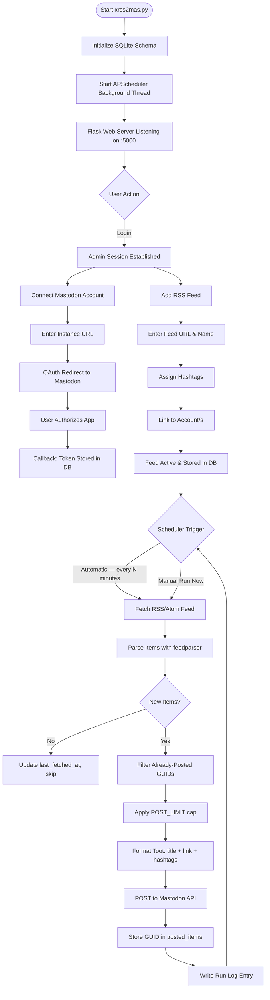
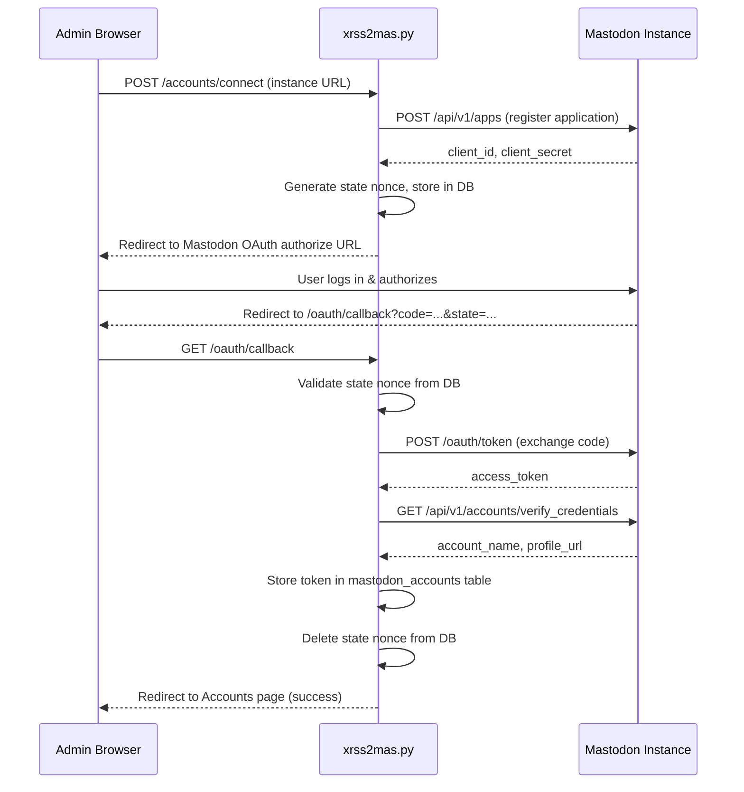

# xsukax RSS to Mastodon

> **Multi-Instance Edition** — Automatically cross-post RSS/Atom feeds to one or more Mastodon accounts, with per-feed hashtags, a live scheduler countdown, and a clean web-based admin panel. All packaged in a **single Python file**.

[](https://www.gnu.org/licenses/gpl-3.0)
[](https://www.python.org/)
[]()

---

## Table of Contents

1. [Project Overview](#project-overview)
2. [Security & Privacy Benefits](#security--privacy-benefits)
3. [Features & Advantages](#features--advantages)
4. [Installation Instructions](#installation-instructions)
5. [Configuration Reference](#configuration-reference)
6. [Usage Guide](#usage-guide)
7. [Architecture & Data Flow](#architecture--data-flow)
8. [php.ini Configuration Notes](#phpini-configuration-notes)
9. [License](#license)

---

## Project Overview

**xsukax RSS to Mastodon** is a self-hosted, single-file Python web application that bridges the gap between traditional RSS/Atom content feeds and the Mastodon federated social network. It continuously monitors your configured RSS sources on a user-defined schedule and automatically publishes new items as public Mastodon statuses — complete with the article title, link, and customisable hashtags.

The application is built on [Flask](https://flask.palletsprojects.com/) for the web interface, [APScheduler](https://apscheduler.readthedocs.io/) for background feed polling, [feedparser](https://feedparser.readthedocs.io/) for robust RSS/Atom parsing, and [SQLite](https://www.sqlite.org/) as a zero-configuration local database. The entire runtime is contained in a single file — `xrss2mas.py` — with no framework scaffolding, no Docker dependency, and no external database server required.

Key capabilities at a glance:

- Connect **multiple Mastodon accounts** across different instances from a single dashboard.
- Map any number of RSS/Atom feeds to one or more accounts simultaneously.
- Attach **custom hashtags** to each feed independently.
- Monitor scheduler activity through a **live countdown timer** and detailed run log.
- Trigger feed processing **manually** at any time alongside the automatic schedule.

---

## Security & Privacy Benefits

Self-hosting is the foundation of this project's security model. Your credentials, feed history, and posting data never leave your own server.

### OAuth 2.0 Authorization Flow

The application integrates with Mastodon exclusively via the **standard OAuth 2.0 authorization code flow**. It registers a dedicated application entry on each Mastodon instance, requests only the minimal scopes required (`write:statuses` and `read:accounts`), and stores the resulting access token locally. Your Mastodon password is never entered into or stored by this application.

### CSRF Protection on All Mutating Routes

Every state-changing form submission (adding feeds, connecting accounts, editing settings) is protected by a **server-side CSRF token** stored in the session and validated using `secrets.compare_digest()` — a constant-time comparison that prevents timing-based token inference attacks.

### Cryptographically Secure Session Keys

On first launch, the Flask session secret key is generated using `secrets.token_hex(32)` — a 256-bit cryptographically random value from the OS entropy pool — and persisted in the local SQLite database. This ensures sessions remain secure and consistent across restarts without manual configuration.

### Authentication-Gated Admin Panel

All administrative routes are protected by the `@admin_required` decorator. Unauthenticated requests are redirected to the login page unconditionally. Session state is checked on every request, not cached at startup.

### Minimal Mastodon API Surface

The application requests only two OAuth scopes:

| Scope | Purpose |
|---|---|
| `write:statuses` | Post new statuses on your behalf |
| `read:accounts` | Verify account credentials after OAuth |

No access to followers, messages, blocks, or any other account data is requested or stored.

### Local-Only Data Storage

All data — feed URLs, posted item history, account tokens, run logs, and settings — is stored in a local SQLite file (`rss_mastodon.db`). Nothing is transmitted to third-party analytics, telemetry, or cloud services. The database uses **WAL (Write-Ahead Logging)** mode and enforces **foreign key constraints** for referential integrity.

### OAuth State Nonce

During the OAuth authorization flow, a `secrets.token_hex(20)` nonce is generated and stored temporarily in the database. This state parameter is validated on the callback to prevent open-redirect and CSRF attacks on the OAuth flow itself. The nonce is deleted immediately after successful token exchange.

### HTML Sanitization of Feed Content

All RSS feed content is passed through `html.unescape()` and an HTML-tag-stripping regex before being included in any Mastodon status. This prevents injected markup in feed entries from propagating to posted content.

---

## Features & Advantages

- **Single-file deployment** — the entire application is `xrss2mas.py`. No build step, no asset pipeline, no template directory.
- **Multi-instance, multi-account** — connect accounts on Mastodon.social, Fosstodon, your private instance, or all three simultaneously.
- **Flexible feed-to-account mapping** — one feed can publish to many accounts; one account can receive from many feeds. Many-to-many, fully configurable.
- **Per-feed hashtags** — define a comma-separated list of hashtags per feed. They are validated (`\w+` Unicode) and appended automatically alongside `#RSS` and `#xsukaxRSS`.
- **Deduplication** — the `posted_items` table records every `(feed_id, account_id, item_guid)` triplet. Items are never re-posted, even across manual and scheduled runs.
- **Oldest-first posting** — within a single run, new items are posted in chronological order (oldest unseen first) for a coherent timeline on Mastodon.
- **Configurable rate limiting** — `POST_LIMIT` caps the number of new posts per feed/account pair per run, and `API_DELAY` adds a delay between consecutive Mastodon API calls to respect server rate limits.
- **Live scheduler countdown** — the dashboard displays a real-time progress bar and countdown to the next scheduled run, updated via client-side JavaScript without polling the server.
- **Run log** — every automatic and manual run records the number of posts, skips, errors, duration in milliseconds, and a per-item summary, viewable from the web UI.
- **Automatic schema migration** — on startup, missing columns are added to existing databases transparently, enabling in-place upgrades from earlier versions.
- **Zero external dependencies beyond pip** — Flask, APScheduler, feedparser, and Requests are the only third-party packages required.

---

## Installation Instructions

### Prerequisites

- Python **3.8** or later
- `pip` (Python package installer)
- Network access to your Mastodon instance(s) and RSS feed sources

### Step 1 — Clone the Repository

```bash
git clone https://github.com/xsukax/xsukax-RSS-to-Mastodon.git
cd xsukax-RSS-to-Mastodon
```

### Step 2 — Install Dependencies

```bash
pip install flask apscheduler feedparser requests
```

For isolated environments (recommended for production):

```bash
python -m venv venv
source venv/bin/activate          # Windows: venv\Scripts\activate
pip install flask apscheduler feedparser requests
```

### Step 3 — (Optional) Edit Configuration

Open `xrss2mas.py` and adjust the constants at the top of the file before the first run:

```python
ADMIN_USERNAME    = "admin"        # Change this
ADMIN_PASSWORD    = "admin@123"    # Change this — use a strong password
RSS_INTERVAL_MINS = 30             # Feed poll interval in minutes
WEB_HOST          = "0.0.0.0"     # Bind address
WEB_PORT          = 5000           # HTTP port
DB_PATH           = "rss_mastodon.db"
POST_LIMIT        = 5              # Max new posts per feed/account per run
API_DELAY         = 0.7            # Seconds between Mastodon API calls
```

### Step 4 — Run the Application

```bash
python xrss2mas.py
```

The application will log startup information to stdout and begin listening:

```
2025-01-01 12:00:00 [INFO] Starting xsukax RSS to Mastodon v2.0.0  →  http://0.0.0.0:5000
```

Open your browser and navigate to `http://localhost:5000`.

### Step 5 — Run as a System Service (Optional, Linux/systemd)

Create `/etc/systemd/system/xrss2mas.service`:

```ini
[Unit]
Description=xsukax RSS to Mastodon
After=network.target

[Service]
Type=simple
User=www-data
WorkingDirectory=/opt/xsukax-RSS-to-Mastodon
ExecStart=/opt/xsukax-RSS-to-Mastodon/venv/bin/python xrss2mas.py
Restart=on-failure
RestartSec=5

[Install]
WantedBy=multi-user.target
```

```bash
sudo systemctl daemon-reload
sudo systemctl enable --now xrss2mas
sudo journalctl -u xrss2mas -f
```

---

## Configuration Reference

All configuration is performed by editing the constants block at the top of `xrss2mas.py`. Restart the process to apply changes.

| Constant | Default | Description |
|---|---|---|
| `ADMIN_USERNAME` | `"admin"` | Web UI login username |
| `ADMIN_PASSWORD` | `"admin@123"` | Web UI login password — **change before exposing to a network** |
| `MASTODON_APP_NAME` | `"xsukax RSS to Mastodon"` | OAuth application name shown on your Mastodon instance |
| `RSS_INTERVAL_MINS` | `30` | Minutes between automatic feed checks |
| `WEB_HOST` | `"0.0.0.0"` | Host to bind the Flask development server |
| `WEB_PORT` | `5000` | TCP port for the web interface |
| `DB_PATH` | `"rss_mastodon.db"` | Path to the SQLite database file |
| `POST_LIMIT` | `5` | Maximum new posts per feed/account pair per run |
| `API_DELAY` | `0.7` | Delay in seconds between consecutive Mastodon API calls |

---

## Usage Guide

### Workflow Overview



### Step-by-Step Workflow

#### 1. Log In

Navigate to `http://localhost:5000` and enter your configured `ADMIN_USERNAME` and `ADMIN_PASSWORD`. A session cookie is set; you will remain logged in until you explicitly log out or the session expires.

#### 2. Connect a Mastodon Account

Go to **Accounts → Connect Account**. Enter the full URL of your Mastodon instance (e.g., `https://mastodon.social`). You will be redirected to your Mastodon instance to authorize the application. After approval, you are returned to the Accounts page and the token is stored in the local database.

You may connect accounts on multiple Mastodon instances. Each appears as a separate entry on the Accounts page with its feed count and total posts published.

#### 3. Add RSS Feeds

Go to **Feeds → Add Feed**. Provide:

- **Feed URL** — the RSS or Atom URL (e.g., `https://example.com/feed.xml`)
- **Display Name** — a label shown in posts and the dashboard (e.g., `"Tech News"`)
- **Hashtags** — comma-separated tags without the `#` symbol (e.g., `technology,opensource`)
- **Linked Accounts** — select one or more connected Mastodon accounts to receive this feed's posts

Feeds can be activated, deactivated, or deleted at any time from the Feeds list.

#### 4. Monitor the Scheduler

The **Dashboard** displays:

- A live countdown progress bar to the next scheduled run
- Summary statistics: total feeds, accounts, posts published, and errors
- Recent run log entries

To trigger an immediate run without waiting for the interval, click **Run Now**.

#### 5. Review the Run Log

Navigate to **Log** to see a detailed history of every run, including trigger type (auto/manual), posts published, items skipped due to `POST_LIMIT`, errors encountered, duration in milliseconds, and a per-item summary.

### Mastodon Status Format

Each published status follows this structure:

```
📰 <Feed Display Name>

<Article Title>

<Article URL>

#RSS #xsukaxRSS #YourCustomTag1 #YourCustomTag2
```

The formatter ensures the final status is always ≤ 500 characters, truncating the title if necessary while preserving the link and hashtags.

### OAuth Flow Detail



---

## php.ini Configuration Notes

If you are deploying `xrss2mas.py` behind a PHP-based web server environment or reverse proxy stack that includes PHP processing (e.g., a shared hosting panel or an Nginx + PHP-FPM setup used for other services on the same host), the following `php.ini` settings are relevant to ensure the Python application operates reliably alongside it.

These settings do **not** apply to the Python application itself; they govern the PHP layer on the same server.

**`/etc/php/8.x/fpm/php.ini` (or your active PHP configuration file):**

```ini
; Ensure long-running requests through the reverse proxy do not
; time out while the Python scheduler is executing feed runs.
max_execution_time = 120
max_input_time = 120
default_socket_timeout = 90

; If you use PHP upload forms on the same host, set sensible limits
; to prevent interference with other running services.
upload_max_filesize = 16M
post_max_size = 20M

; Disable unnecessary PHP output buffering that may interfere with
; proxied responses to the Flask app.
output_buffering = Off

; Recommended: disable URL-based PHP inclusion that could expose
; the SQLite database file if the web root is misconfigured.
allow_url_include = Off
allow_url_fopen = Off
expose_php = Off
```

**Nginx reverse proxy snippet** (to forward traffic to the Flask server on port 5000):

```nginx
server {
    listen 80;
    server_name yourdomain.example.com;

    location / {
        proxy_pass         http://127.0.0.1:5000;
        proxy_set_header   Host              $host;
        proxy_set_header   X-Real-IP         $remote_addr;
        proxy_set_header   X-Forwarded-For   $proxy_add_x_forwarded_for;
        proxy_set_header   X-Forwarded-Proto $scheme;
        proxy_read_timeout 120s;
        proxy_send_timeout 120s;
    }
}
```

> **Security note:** Never expose the SQLite database file (`rss_mastodon.db`) through a web-accessible directory. Ensure your web server configuration explicitly denies access to `.db` files.

---

## License

This project is licensed under the **GNU General Public License v3.0** — see the [LICENSE](https://www.gnu.org/licenses/gpl-3.0.html) file for full terms.

---

*Maintained by [@xsukax](https://github.com/xsukax) — contributions and issues welcome via the [GitHub repository](https://github.com/xsukax/xsukax-RSS-to-Mastodon).*
